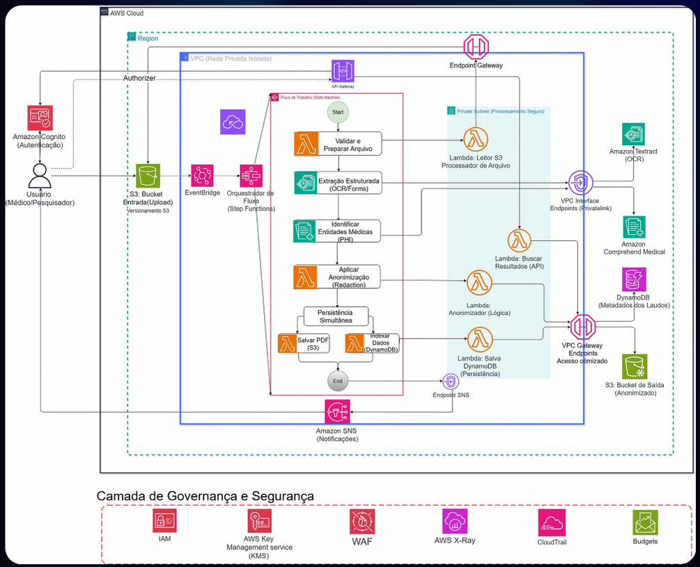

# 👁️ HORUS IA - Arquitetura Serverless para Processamento de Laudos Médicos

> **Status do Projeto:** Prova de Conceito Arquitetural (PoC) / Design de Solução.
> **Contexto:** Projeto Final desenvolvido para a **Escola da Nuvem** (Programa AWS re/Start - Extensão em IA).

## 📌 Visão Geral
O **HORUS IA** é uma proposta de arquitetura de dados 100% Serverless e orientada a eventos. O objetivo principal é resolver o desafio do processamento manual de documentos na área da saúde, mitigando o alto custo administrativo, reduzindo a taxa de erro humano e resolvendo o problema dos dados não estruturados ("Dark Data").

A solução automatiza a ingestão de laudos em PDF/Imagens, extrai o texto bruto, identifica Informações de Saúde Protegidas (PHI) e gera uma versão anonimizada do documento para garantir conformidade com a LGPD e HIPAA.

---

## 🏗️ Arquitetura da Solução

A arquitetura foi desenhada utilizando os pilares do **AWS Well-Architected Framework**, com forte ênfase em escalabilidade, segurança e otimização de custos.

 

### Fluxo de Processamento (Event-Driven)
1. **Ingestão:** O usuário faz o upload do documento médico em um **Amazon S3** (Bucket de Entrada).
2. **Orquestração:** O **Amazon EventBridge** detecta o upload e aciona o **AWS Step Functions**, que atua como o maestro do fluxo de trabalho, garantindo tratamento de erros e resiliência.
3. **Extração (OCR):** O documento é processado pelo **Amazon Textract** para digitalização de alta fidelidade.
4. **Inteligência Artificial (NLP):** O texto extraído é enviado ao **Amazon Comprehend Medical**, que identifica entidades clínicas e detecta dados sensíveis (PHI).
5. **Computação e Anonimização:** Funções **AWS Lambda** isoladas processam os resultados e aplicam tarjas (redaction) no PDF original, gerando um documento seguro.
6. **Persistência:** O arquivo anonimizado é salvo no S3 de Saída, e os metadados estruturados (prontos para Analytics) são gravados em tabelas NoSQL do **Amazon DynamoDB**.

---

## 🛡️ Security by Design (DevSecOps)

A segurança e a governança dos dados foram integradas desde a concepção (Shift-Left). Para proteger as informações contra exfiltração e acessos indevidos:

* **Isolamento de Rede:** Toda a computação (Lambdas) ocorre dentro de uma **VPC Privada sem Internet Gateway**.
* **Tráfego Interno:** A comunicação com os serviços AWS é feita exclusivamente via **AWS PrivateLink (VPC Endpoints)**, garantindo que os dados não trafeguem pela internet pública.
* **Governança:** Acesso via API Gateway protegido por **Amazon Cognito**. Criptografia via **AWS KMS** e auditoria contínua através do **AWS CloudTrail** e **AWS X-Ray**. Princípio do privilégio mínimo aplicado via **AWS IAM**.

---

## 💰 FinOps e Eficiência de Custos

Ao adotar um modelo totalmente Serverless (FaaS), o sistema não gera custos quando ocioso. Através da ferramenta AWS Pricing Calculator, foi validada a viabilidade econômica do projeto para uma clínica de pequeno/médio porte.

* **Custo Estimado Mensal:** ~US$ 24,29 (para 1.000 laudos processados).
* **Custo por Documento:** Inferior a **US$ 0,03**, eliminando barreiras financeiras para a adoção de tecnologia na saúde.

---

## 🚀 Roadmap (Evolução Futura)
Como próximos passos para uma versão 2.0 (Backlog), o design contempla:
* Integração com **Amazon Bedrock (GenAI)** para geração de resumos clínicos automatizados.
* Uso do **Amazon Translate** para suporte multi-idioma de laudos estrangeiros.
* Estratégia de *Disaster Recovery (DR)* com replicação Cross-Region no S3 e DynamoDB.

---
*Projeto idealizado e documentado por **Giane Costa**.* [🔗 Conecte-se comigo no LinkedIn](https://www.linkedin.com/in/giane-costa/)
